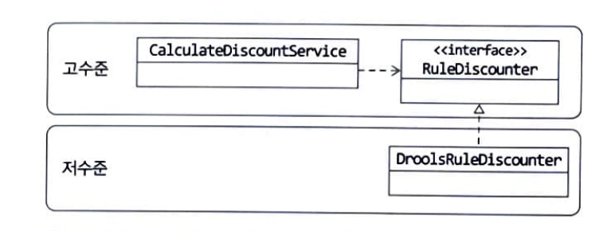

고수준 모델 : 의미 있는 단일 기능을 제공하는 모듈이다

저수준 모듈 :하위 기능을 실제로 구현한 것이다

고수준 모듈을 데대로 동작하려면 저수준 모듈을 사용해야 한다
그러나 고수준 모듈이 저수준 모듈을 사용하면 2가지 문제가 있다
1. 구현 변경의 어려움
2. 테스트 구현 어려움

dip는 위 문제를 해결하여 저수준 모듈이 고수준 모듈에 의존하도록 바꾼다
-> 추상화한 인터페이스를 사용한다

저수준 모듈에 다양한 구현 기술을 사용하더라도 고수준이 저수준 모듈을 이용하려면 하나의 인터페이스를 통해서만 접근하가능하게 만드는 것이다
-> 즉 저수준 모듈이 고수준 모듈을 의존하게 되는 것이다 
원래는 고수준이 저수준 모듈을 사용하려면 고수준 모듈이 저수준 모듈을 의존해야 하는데, 
반대로 저수준 모듈이 고수준 모듈에 의존한다고 해서 의존성이 역전되었다
즉 DIP(dependency Inversion principle)이라고 하는 것이다

이러면 위에서 보았던 구현 변경의 어려움 해결과
테스트 코드 구현시 대역객체를 사용해서 테스트를 진행할수 있다

dip 주의사항
- dip를 단순히 인터페이스와 구현 클래스를 분리하는 정도로 받아들이면 안된다
-> dip 의 핵심은 고수준 모듈이 저수준 모듈에 의존하지 않기 위함이다

- dip 를 적용할때 하위 기능(구현기능)을 추상화한 인터페이스는 고수준모듈 관점에서 도출해야 한다