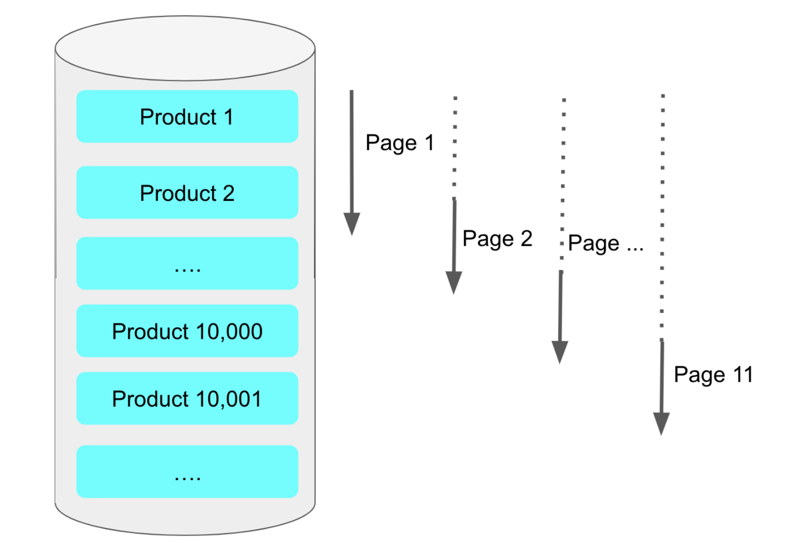

## No Offset 으로 구조 변경하기 

---


기존에 사용하는 페이징 쿼리는 일반적으로 아래와 같았다

```sql
SELECT *
FROM items
WHERE 조건문
ORDER BY id DESC
OFFSET 페이지번호
LIMIT 페이지사이즈
```

위 의 쿼리는 페이징 쿼리가 뒤로 갈수록 느리다
이유는 **앞에서 읽었던 행을 다시 읽어야 하기 때문** 이다
예를 들어 offset이 10000이고 limit이 20이라면 결과적으로 10000개부터 20개를 읽어야하니 10020개를 읽고 10000개를 버리는 행위와 같은 형태다




결론:
No Offset 방식은 **조회 시작 부분을 인덱스로 빠르게 찾아 매번 첫 페이지만 읽도록 하는 방식** 이다

 = No Offset 방식은 바로 이 부분에서 **조회 시작 부분을 인덱스로 빠르게 찾아** 매번 첫 페이지만 읽도록 하는 방식입니다.  
(클러스터 인덱스인 PK를 조회 시작 부분 조건문으로 사용했기 때문에 빠르게 조회됩니다.)


### 잘못된 예시

```java
public List<BookPaginationDto> paginationLegacy(String name, int pageNo, int pageSize) {
    return queryFactory
            .select(Projections.fields(BookPaginationDto.class,
                    book.id.as("bookId"),
                    book.name,
                    book.bookNo))
            .from(book)
            .where(
                    book.name.like(name + "%") // like는 뒤에 %가 있을때만 인덱스가 적용됩니다.
            )
            .orderBy(book.id.desc()) // 최신순으로
            .limit(pageSize) // 지정된 사이즈만큼
            .offset(pageNo * pageSize) // 지정된 페이지 위치에서 
            .fetch(); // 조회
}
```

기존 코드가 위와 같이 offset + limit 까지 읽어와서 offset을 버리고 반환하는 형식이다


### 아주 좋은 예시

1. ==프론트엔드한테 페이징 조회시 검색 시작할 bookId를 받아온다==

2. 그리고 프로트엔드한테 받아온 bookid를 where 조건에 넣는다!

3. 그리고 조회할 개수는 limit로 걸어서 조회한다

```java
public List<BookPaginationDto> paginationNoOffset(Long bookId, String name, int pageSize) {

    return queryFactory
            .select(Projections.fields(BookPaginationDto.class,
                    book.id.as("bookId"),
                    book.name,
                    book.bookNo))
            .from(book)
            .where(
                    ltBookId(bookId), //프로트엔드한테 받아온 bookid를 where 조건에 넣는다!
                    book.name.like(name + "%")
            )
            .orderBy(book.id.desc())
            .limit(pageSize)
            .fetch();
}

private BooleanExpression ltBookId(Long bookId) {
    if (bookId == null) {
        return null; // BooleanExpression 자리에 null이 반환되면 조건문에서 자동으로 제거된다
    }

    return book.id.lt(bookId);
}
```


- ltBookId 메서드
여기서 **첫 페이지 조회할 때**와 **두번째 페이지부터 조회할 때** 사용되는 쿼리가 달라 동적 쿼리가 필요하다
(첫 페이지를 조회할때는 기준이 되는 id 값을 알 수 없기 때문이다)

##### 성능 수치
1억 row, 5개의 컬럼 기준 
26초 -> 0.83초 로 개선되었다


### 장점
> 1. 이렇게 쿼리를 날리면 offset 만큼의 데이터를 읽을 필요가 없게 된다
> 2. 또한, 클러스터 인덱스인 Id값을 조건문으로 시작했기 때문에 빠르게 조회할수도 있다!


### 1-5. 단점

-   where에 사용되는 **기준 Key가 중복이 가능할 경우**
    -   이를 테면 `group by` 등으로 기준으로 잡을 Key가 중복이 될 경우 정확한 결과를 반환할 수 없어서 사용할 수가 없다
-   회사 혹은 서비스 정책상 (or UX 관점에서) More 버튼은 안되며, 무조건 페이징 버튼 형식으로만 해야한다고 하면 답이 없다
    -   NoOffset 은 순차적으로 다음페이지 이동만 가능하며, 1페이지에서 갑자기 9페이지로 가는 등 일반적인 페이징 버튼으로서의 기능은 사용할 수 없습니다.

즉, more 버튼으로 페이징 처리하지 않고, where 절에 기준점이 되는 key가 중복이 가능한 경우 no offset 사용이 불가하다

https://jojoldu.tistory.com/529?category=637935