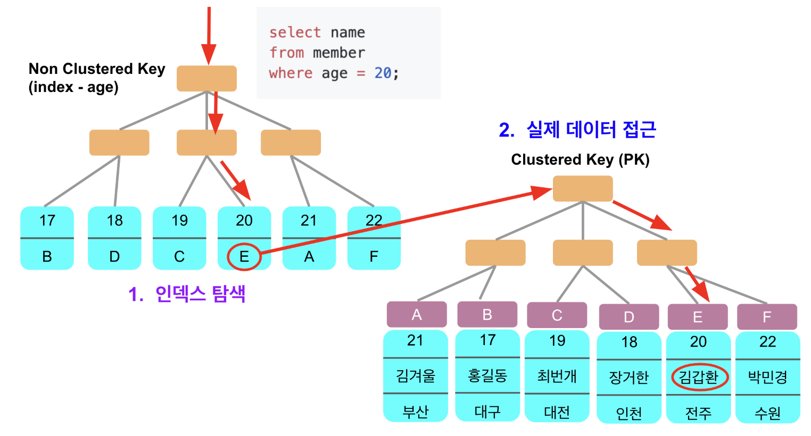

##  (1) 커버링 인덱스

---

커버링 인덱스란?
쿼리를 충족시키는데 필요한 모든 컬럼을 갖고 있는 인덱스다
이는 select / where / order by /group by 등에서 사용되는 모든 projection attribute들이 인덱스에 포함된 상태를 의미한다

### 언제 최적화가 가능하나?

where 조건에 non-clustered(일반적인 인덱스) 키로 조회하며, select(=projection attirbutes)에는 인덱스에 포함된 컬럼 외의 것들이 있는 경우
커버버링 인덱스로 최적화 가능하다


#### 잠깐 사전 지식 - Clustered Key, non Clustered key
Clustered Key
아래 클러스터 키를 결정하는 3가지 우선순위 경우
1) PK  
2) PK가 없을땐 유니크키  가 클러스터 키다
3) 1~2 둘다 없을 경우 6byte의 Hidden Key를 생성 (rowid)
- 테이블당 1개만 존재 가능

Non Clustered Key: 일반적인 인덱스 ,여러개 생성 가능


1. non clustered 인덱스로 clustered key 값을 가져오고 (non clustered key는 clustered key를 항상 포함한다)
- MySQL에서는 **Non Clustered Key에 Clustered Key가 항상 포함**되어 있다, 이유는 Non Clustered Key에는 **데이터 블록의 위치가 없기 때문**이다
2. 가져온 clustered key로 다시 쿼리를 날려서 원하는 데이터를 가져온다

즉, 인덱스 조건에 부합한 `where` 조건이 있더라도 `select`에 **인덱스에 포함된 컬럼 외에 다른 컬럼값**이 필요할때는 Non Clustered Key에 있는 Clustered Key 값으로 데이터 블록을 찾는 과정이 필요합니다.


예시)
select 절에서 `*` 를 이용하여 단순히 조회하고, where 조건문에 Non Clustered Key(보조 인덱스)를 사용한 경우,
"Non Clusterd Key(보조 인덱스)에 있는 Clusted Key"를 이용해 다시 실제 데이터 접근을 하여 데이터를 가져오게 된다 
(MySQL에서는 **Non Clustered Key에 Clustered Key가 항상 포함**되어 있다, 이유는 Non Clustered Key에는 **데이터 블록의 위치가 없기 때문**이다)

결과적으로 
1. 제일 먼저 보조 인덱스로 검색하고 
2. 보조 인덱스에 있는 cluster index에 대해 검색하게 된다

만약 우리가 커버링 인덱스를 사용할 경우, 1차 검색만으로 끝낼 수 있게 된다

  

예제 테이블: Book 테이블

```mysql
create table book(
	id bigint not null auto_increment,
    book_no bigint not null,
    name varchar(255) not null,
    type varchar(255),
    primary key(id),    //-> 이게 pk이며, "클러스터 인덱스"이고,"커버링 인덱스 대상"이다
    index idx_name(name) //-> 이게 "non-클러스터 인덱싱"을 해준것이다
);
```


### 비효율적인 접근
select 문에서는 인덱스 대상이 아닌 "book_no와 book_type"가 있기 때문에 커버링 인덱스로 최적화될수 없다
아래 쿼리는 보조인덱스(idx_name)로 검색하고
pk 값으로 cluster index를 검색한다

-> 즉, 매번 id찾고 실제 데이터에 접근한다
id에 10개가 있으면 이 작업을 10번 반복한다

```mysql
# 비효율적 접근

select id, book_no, book_type, name
from book
where name like '200%'
order by id desc
limit 10 offset 10000;
```

### 효율적인 접근

해결방안
1. book_id라는 pk값을 "커버링 인덱스"로 ==한번에== 먼저 가져온다
2. 가져온 book_id를 조건문으로 넣으면, pk 값으로 조회하는 것이니깐 빠른 조회를 할수 있다

즉,
1. pk인 커버링 인덱스 대상은 ==한번에== 조회하고
2. 조회된 pk값을 where 조건에 넣어서 최종적으로 원하는 값을 얻어낸다


```java
public List<BookPaginationDto> paginationCoveringIndex(String name, int pageNo, int pageSize) {
        // 1) 커버링 인덱스로 대상 조회
        List<Long> ids = queryFactory
                .select(book.id)
                .from(book)
                .where(book.name.like(name + "%"))
                .orderBy(book.id.desc())
                .limit(pageSize)
                .offset(pageNo * pageSize)
                .fetch();

        // 1-1) 대상이 없을 경우 추가 쿼리 수행 할 필요 없이 바로 반환
        if (CollectionUtils.isEmpty(ids)) {
            return new ArrayList<>();
        }

        // 2)
        return queryFactory
                .select(Projections.fields(BookPaginationDto.class,
                        book.id.as("bookId"),
                        book.name,
                        book.bookNo,
                        book.bookType))
                .from(book)
                .where(book.id.in(ids))
                .orderBy(book.id.desc())
                .fetch(); 
}
```


 id 10개만 가져와 조인하기 때문에 딱 10번의 데이터만 접근해도 됩니다. 
 또한 가져오는 값이 러스터 인덱스기 때문에 주소를 검색하는 추가 작업 없이 데이터 테이블에 바로 접근할 수 있습니다.


## (2) + 추가 쿼리 튜닝:  No Offset 으로 구조 변경하기 

---

기존에 사용하는 페이징 쿼리는 일반적으로 아래와 같았다

```sql
SELECT *
FROM items
WHERE 조건문
ORDER BY id DESC
OFFSET 페이지번호
LIMIT 페이지사이즈
```

위 의 쿼리는 페이징 쿼리가 뒤로 갈수록 느리다
이유는 **앞에서 읽었던 행을 다시 읽어야 하기 때문** 이다
예를 들어 offset이 10000이고 limit이 20이라면 결과적으로 10000개부터 20개를 읽어야하니 10020개를 읽고 10000개를 버리는 행위와 같은 형태다

  

결론:
No Offset 방식은 **조회 시작 부분을 인덱스로 빠르게 찾아 매번 첫 페이지만 읽도록 하는 방식** 이다


### 잘못된 예시

```java
public List<BookPaginationDto> paginationLegacy(String name, int pageNo, int pageSize) {
    return queryFactory
            .select(Projections.fields(BookPaginationDto.class,
                    book.id.as("bookId"),
                    book.name,
                    book.bookNo))
            .from(book)
            .where(
                    book.name.like(name + "%") // like는 뒤에 %가 있을때만 인덱스가 적용됩니다.
            )
            .orderBy(book.id.desc()) // 최신순으로
            .limit(pageSize) // 지정된 사이즈만큼
            .offset(pageNo * pageSize) // 지정된 페이지 위치에서 
            .fetch(); // 조회
}
```

기존 코드가 위와 같이 offset + limit 까지 읽어와서 offset을 버리고 반환하는 형식이다

### 아주 좋은 예시

1. ==프론트엔드한테 페이징 조회시 검색 시작할 bookId를 받아온다==

2. 그리고 프로트엔드한테 받아온 bookid를 where 조건에 넣는다!

3. 그리고 조회할 개수는 limit로 걸어서 조회한다

```java
public List<BookPaginationDto> paginationNoOffset(Long bookId, String name, int pageSize) {

    return queryFactory
            .select(Projections.fields(BookPaginationDto.class,
                    book.id.as("bookId"),
                    book.name,
                    book.bookNo))
            .from(book)
            .where(
                    ltBookId(bookId), //프로트엔드한테 받아온 bookid를 where 조건에 넣는다!
                    book.name.like(name + "%")
            )
            .orderBy(book.id.desc())
            .limit(pageSize)
            .fetch();
}

private BooleanExpression ltBookId(Long bookId) {
    if (bookId == null) {
        return null; // BooleanExpression 자리에 null이 반환되면 조건문에서 자동으로 제거된다
    }

    return book.id.lt(bookId);
}
```

### 장점
> 1. 이렇게 쿼리를 날리면 offset 만큼의 데이터를 읽을 필요가 없게 된다
> 2. 또한, 클러스터 인덱스인 Id값을 조건문으로 시작했기 때문에 빠르게 조회할수도 있다!


## 실제 프로젝트에 적용한 간략한 코드

```java
// 쿼리 최적화 커버링 인덱스로 빠르게 땡겨오고 필요한 필드만 dto로 조회함과 동시에 이미 알고 있는 필드는 as 표현식  
// 쿼리최적화 no offsetpublic Slice<SpotPageResponse> findPageBySpotName(String spotName, Long lastSpotId, Pageable pageable) {  
  
   List<Long> ids = query  
      .select(spot.id)  
      .from(spot)  
      .where(spot.name.like(spotName + "%"),  
         ltSpotId(lastSpotId))  
      .orderBy(spot.id.asc())  
      .limit(pageable.getPageSize() + 1)  
      .fetch();  
  
   // 1-1) 대상이 없을 경우 추가 쿼리 수행 할 필요 없이 바로 반환  
   if (CollectionUtils.isEmpty(ids)) {  
      return new SliceImpl<>(new ArrayList<>(), pageable, false);  
   }  
  
   // 2)  
   List<SpotPageResponse> content = query  
      .select(Projections.fields(SpotPageResponse.class,  
         spot.id.as("spotId"),  
         Expressions.asString(spotName).as("spotName"),  
         spot.address,  
         spot.description,  
         spot.location))  
      .from(spot)  
      .where(spot.id.in(ids),  
         ltSpotId(lastSpotId))  
      .orderBy(spot.id.asc())  
      .limit(pageable.getPageSize() + 1)  
      .fetch();  
  
   return RepositorySupport.toSlice(content,pageable);  
}  
  
private BooleanExpression ltSpotId(Long lastSpotId) {  
   if (lastSpotId == null)  
      return null;  
   return spot.id.lt(lastSpotId);  
}
```

-------

## (3) findByXXXId 성능 이슈

### spring data jpa의 성능 이슈

XXXID로 해당 엔티티의 참조된 id 접근하는게 아니라
실제 XXX와 조인하여 id에 접근한다

-> 즉 불필요한 조인이 나간다


### 해결
@Query로 순수 jpql 쿼리를 짜준다

ex) findByTeamId(Long id)가 아니라

@Query("select m from member m where m.team.id = :id")
로 지겁 jpql 로 날리면 된다